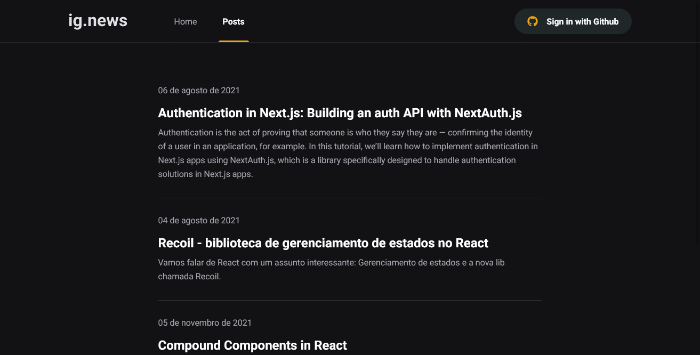

    

  <a href = "https://ignews-maur32.vercel.app/">
	ig.news :atom_symbol:
	</a>

 

# :information_source: Sobre 
Projeto desenvolvido durante o Ignite na trilha ReactJS, um blog que possui um sistema de assinatura, em que o usuário tem acesso aos posts depois de efetuado o pagamento  
# :computer: Tecnologias

- [Next.js](https://nextjs.org/)
- [Prismic CMS](https://prismic.io/)
- [Stripe](https://stripe.com/)
- [FaunaDB](https://fauna.com/)

 

 
 
 

